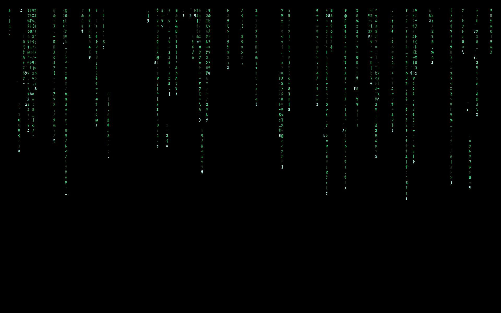

# Wallpapers

A collection of my favorite wallpapers.

**Resolution:** 1920×1200  
**Note:** These wallpapers are not optimized for higher-resolution displays.

Feel free to browse, download, or use them as inspiration.

# Preview

<!-- WALLPAPER_PREVIEW_START -->
<table>
<tr>
<td align="center">
  
  </td>
<td align="center">
  
  </td>
<td align="center">
  
  </td>
</tr>
<tr>
<td align="center">
  
  </td>
<td align="center">
  
  </td>
<td align="center">
  
  </td>
</tr>
<tr>
<td align="center">
  
  </td>
<td align="center">
  
  </td>
<td align="center">
  
  </td>
</tr>
<tr>
<td align="center">
  
  </td>
<td align="center">
  
  </td>
<td align="center">
  
  </td>
</tr>
<tr>
<td align="center">
  
  </td>
<td align="center">
  
  </td>
<td align="center">
  
  </td>
</tr>
<tr>
<td align="center">
  
  </td>
<td align="center">
  
  </td>
<td align="center">
  
  </td>
</tr>
<tr>
<td align="center">
  
  </td>
<td align="center">
  
  </td>
<td align="center">
  
  </td>
</tr>
<tr>
<td align="center">
  
  </td>
<td align="center">
  
  </td>
<td align="center">
  
  </td>
</tr>
<tr>
<td align="center">
  
  </td>
<td align="center">
  
  </td>
<td align="center">
  
  </td>
</tr>
<tr>
<td align="center">
  
  </td>
<td align="center">
  
  </td>
<td align="center">
  
  </td>
</tr>
<tr>
<td align="center">
  
  </td>
<td align="center">
  
  </td>
<td align="center">
  
  </td>
</tr>
<tr>
<td align="center">
  
  </td>
<td align="center">
  
  </td>
<td align="center">
  
  </td>
</tr>
<tr>
<td align="center">
  
  </td>
<td align="center">
  
  </td>
<td align="center">
  
  </td>
</tr>
<tr>
<td align="center">
  
  </td>
<td align="center">
  
  </td>
<td align="center">
  
  </td>
</tr>
<tr>
<td align="center">
  
  </td>
<td align="center">
  
  </td>
<td align="center">
  
  </td>
</tr>
<tr>
<td align="center">
  
  </td>
<td align="center">
  
  </td>
<td align="center">
  
  </td>
</tr>
<tr>
<td align="center">
  
  </td>
<td align="center">
  
  </td>
<td align="center">
  
  </td>
</tr>
<tr>
<td align="center">
  
  </td>
<td align="center">
  
  </td>
<td align="center">
  
  </td>
</tr>
<tr>
<td align="center">
  
  </td>
<td align="center">
  
  </td>
<td align="center">
  
  </td>
</tr>
<tr>
<td align="center">
  
  </td>
<td align="center">
  
  </td>
<td align="center">
  
  </td>
</tr>
<tr>
<td align="center">
  
  </td>
<td align="center">
  
  </td>
<td align="center">
  
  </td>
</tr>
<tr>
<td align="center">
  
  </td>
<td align="center">
  
  </td>
<td align="center">
  
  </td>
</tr>
<tr>
<td align="center">
  
  </td>
<td align="center">
  
  </td>
<td align="center">
  
  </td>
</tr>
<tr>
<td align="center">
  
  </td>
<td align="center">
  
  </td>
<td align="center">
  
  </td>
</tr>
<tr>
<td align="center">
  
  </td>
<td align="center">
  
  </td>
</table>
<!-- WALLPAPER_PREVIEW_END -->

